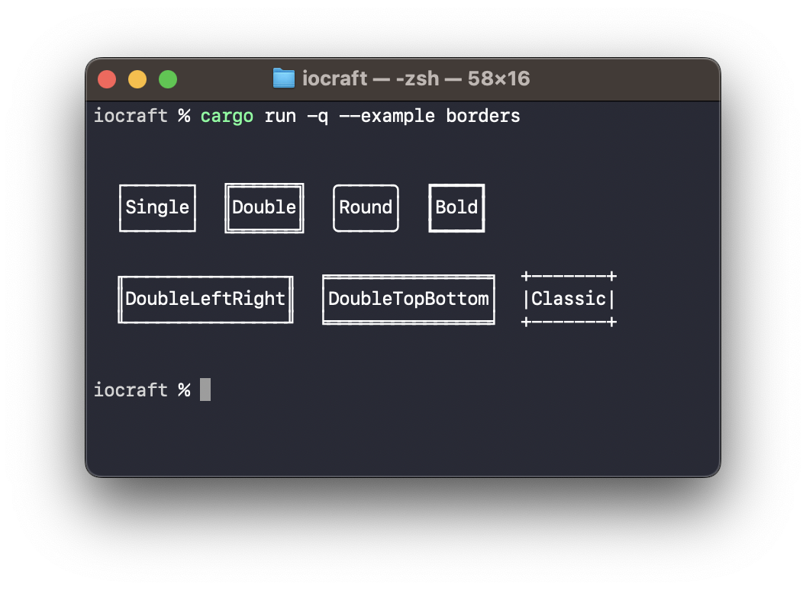
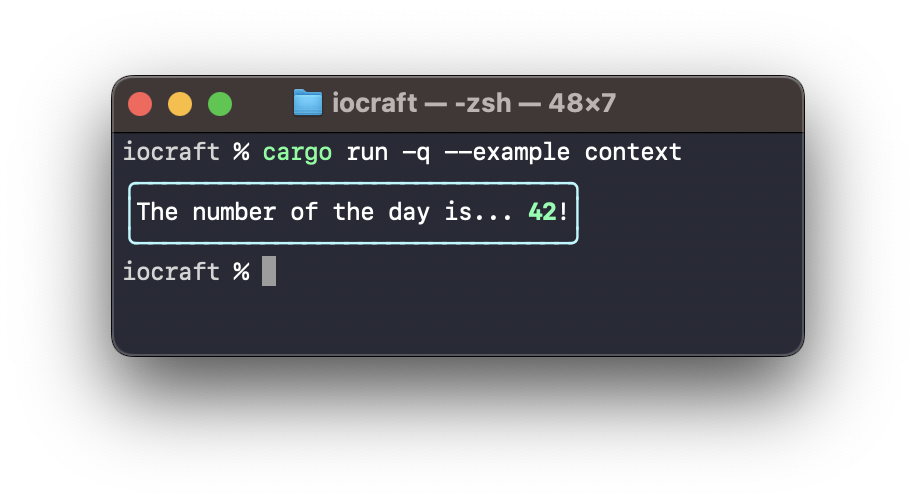
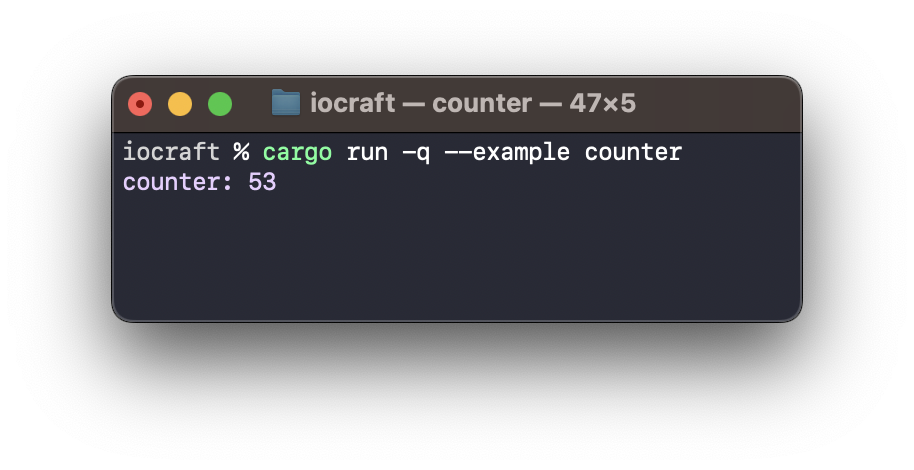
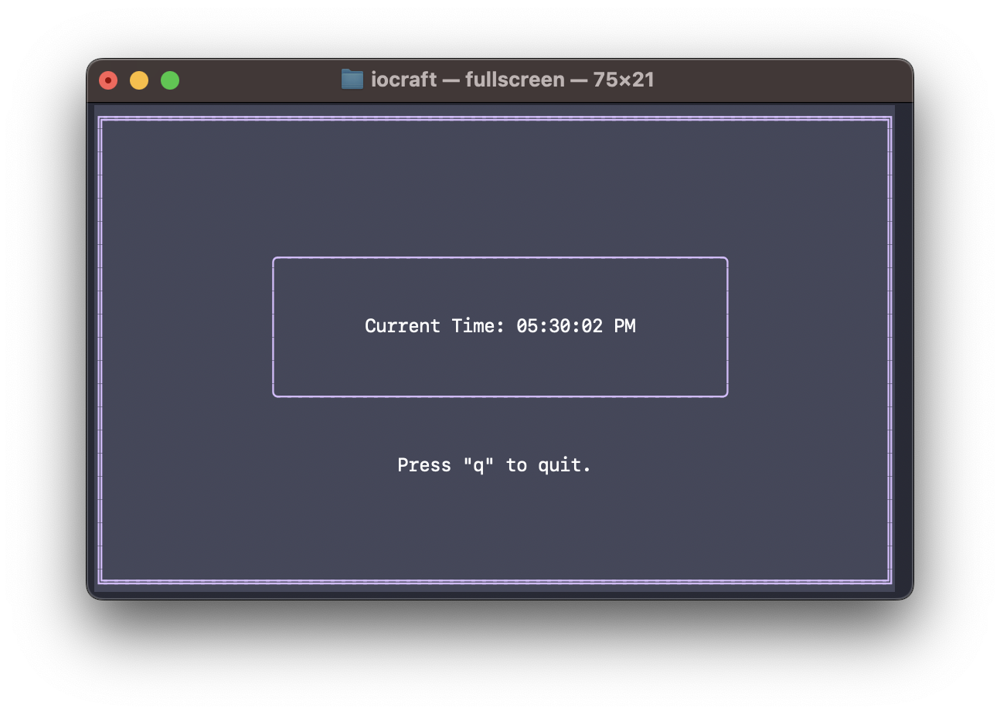
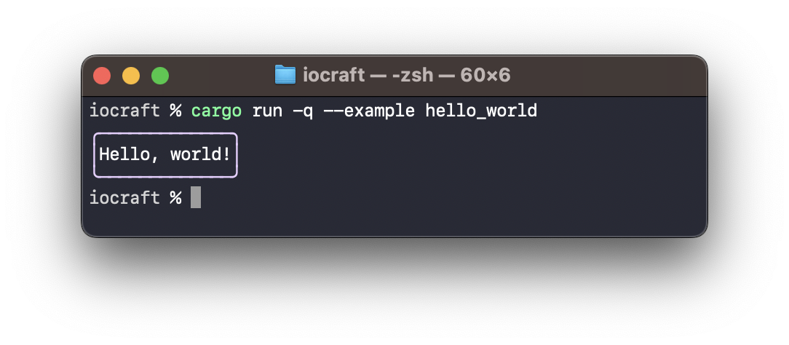
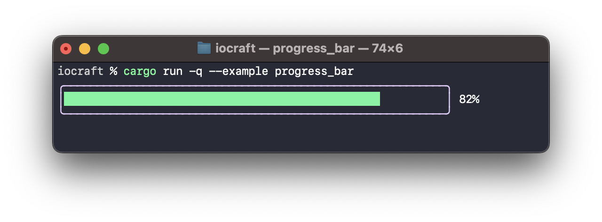
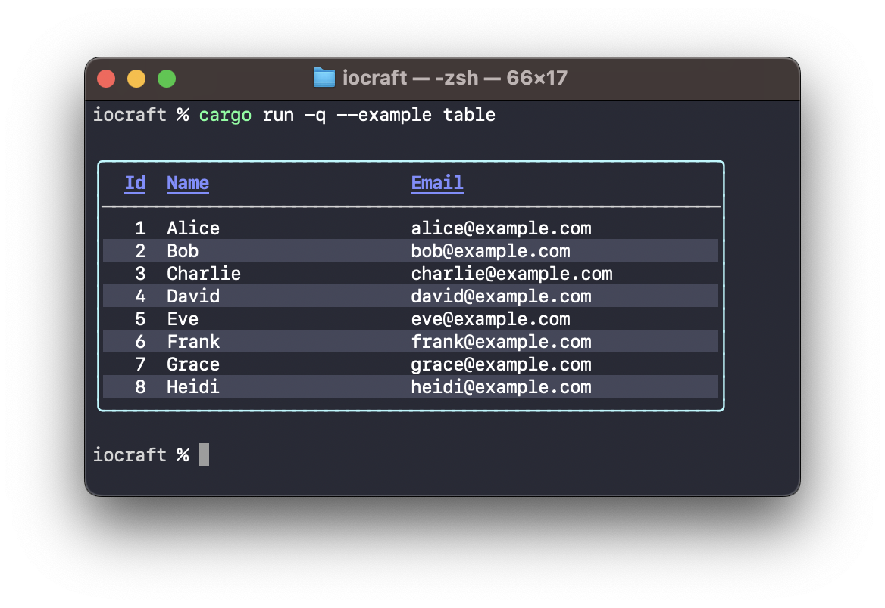
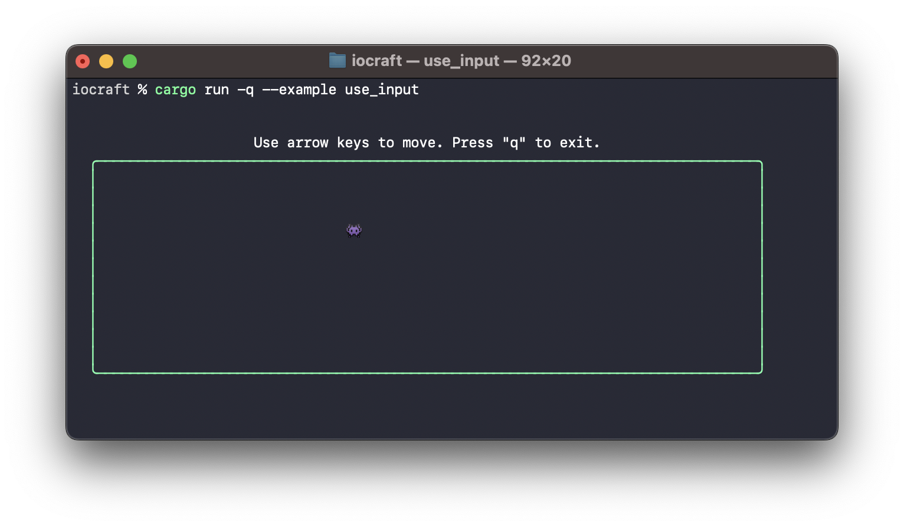
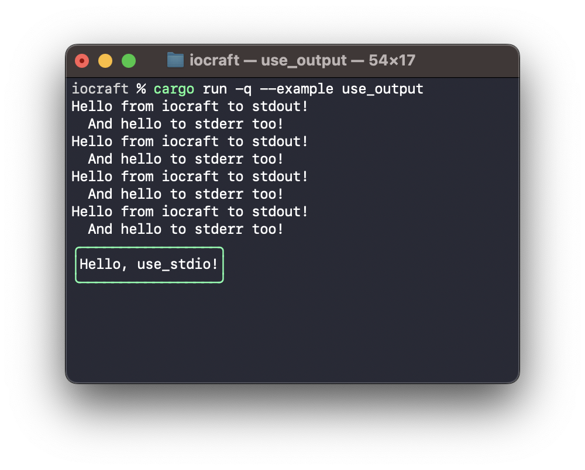
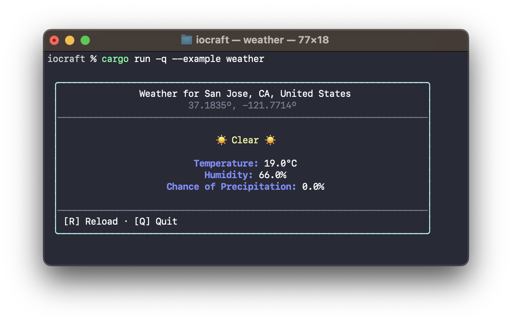

# Examples

In this directory, you'll find many examples for various concepts and features of [iocraft](https://github.com/ccbrown/iocraft/).

To run any of the examples, use `cargo run --example NAME`. For example, to run the table example: `cargo run --example table`

## Table of Contents

|Example|Preview|
|---|:---:|
|[borders.rs](./borders.rs) Showcases various border styles.||
|[context.rs](./context.rs) Demonstrates using a custom context via `ContextProvider` and `use_context`.||
|[counter.rs](./counter.rs) Renders a dynamic component which spawns a future to increment a counter every 100ms.||
|[form.rs](./form.rs) Displays a form prompting the user for input into multiple text fields. Uses mutable reference props to surface the user's input to the caller once the form is submitted.||
|[fullscreen.rs](./fullscreen.rs) Takes over the full terminal, rendering to an alternate buffer and preventing the user from scrolling.||
|[hello_world.rs](./hello_world.rs) Hello, world!||
|[progress_bar.rs](./progress_bar.rs) Renders a dynamic progress bar which fills up and then exits.||
|[table.rs](./table.rs) Displays a list of users provided by reference via properties.||
|[use_input.rs](./use_input.rs) Demonstrates using keyboard input to move a 👾.||
|[use_output.rs](./use_output.rs) Continuously logs text output above the rendered component.||
|[weather.rs](./weather.rs) Demonstrates asynchronous loading of data from remote APIs in response to user input.||
